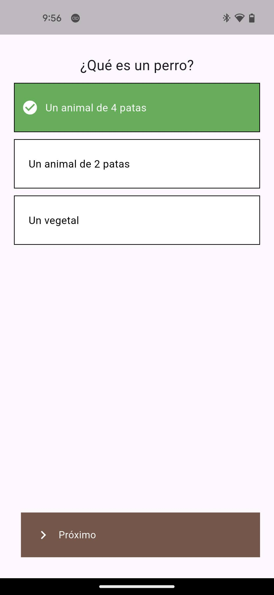

# wise_tardigrade

Open Source Local network(no internet required) test administering system.

## Note
This is the mobile app for taking tests made using wise_tardigrade_desktop

## How to use
Just install and open the app, scan the qr code from the examiner's device and select the responses.

## For the desktop version
[https://github.com/LiveUser/wise_tardigrade_desktop/releases](https://github.com/LiveUser/wise_tardigrade_desktop/releases)